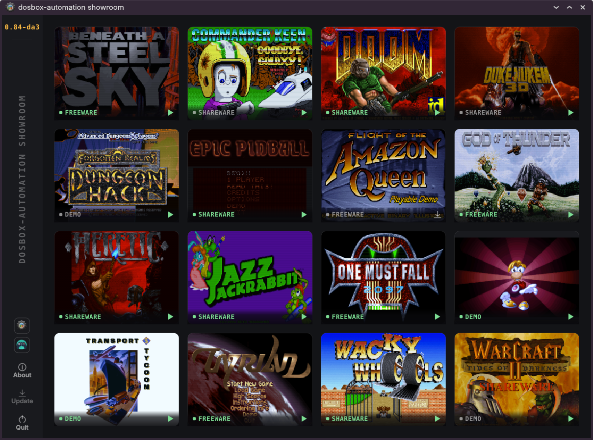
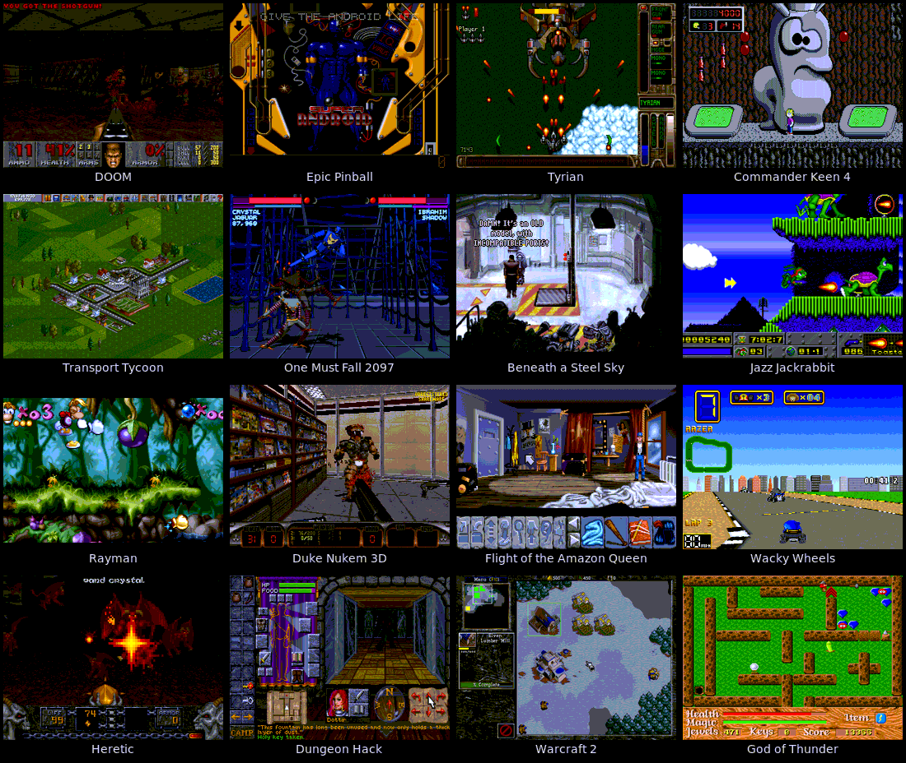

# dosbox-automation showroom

![GPL-3.0-or-later][gpl-badge]
[![Download showroom][download-badge]][showroom-releases]
[![Get dosbox-automation][engine-badge]][engine-releases]

Sixteen DOS games, one click each, from nothing installed to playing.

<p align="center">
  
</p>

Pick a game from the grid. The showroom downloads it, runs the original DOS
installer through its own prompts, and starts the game. No manual mounting,
no setup wizards, no CONFIG.SYS editing.

The showroom is a desktop frontend for
[dosbox-automation](https://github.com/dosbox-automation/dosbox-automation),
a DOSBox fork with an HTTP REST API and Lua scripting engine. Everything the
showroom does - fetching, installing, configuring, launching - goes through
that API. The showroom is the demonstration of what the automation layer
can do.

## The games

<p align="center">
  
</p>

DOOM, Epic Pinball, Tyrian, Commander Keen 4, Transport Tycoon,
One Must Fall 2097, Beneath a Steel Sky, Jazz Jackrabbit, Rayman,
Duke Nukem 3D, Flight of the Amazon Queen, Wacky Wheels, Heretic,
Dungeon Hack, Warcraft 2, and God of Thunder.

All shareware, freeware, or publisher-released demos. The showroom does not
ship or download anything commercial. Game files are downloaded on first
install from their original distribution sources.

## Downloads

The showroom ships as combo packages that include the dosbox-automation
engine alongside the showroom application.

**Linux:**
- Combo tarball (glibc 2.27, Qt libraries bundled, launcher script included)
- Combo AppImage

**Windows:**
- Combo portable zip (dosbox.exe + showroom.exe, run from any folder)
- Showroom standalone zip (for use with an existing engine install)

Downloads are on the [releases page](../../releases).

## Running

**(Linux) portable tarball:** extract, then run `./showroom.sh`.

**(Linux) AppImage:** `chmod +x` and run. The AppImage
defaults to the showroom. Pass `--engine` to run dosbox-automation directly.

**(Windows) portable zip:** extract and run `showroom.exe`. The engine
(`dosbox.exe`) must be in the same folder, which it is in the combo zip.

Showroom needs on the first run a dosbox-automation API token and will write it to `~/.config/dosbox-automation/webserver/api_token` on its first
start with the webserver enabled. Afterwards, it will read out automatically.

---
## Developer information

### How installation recipes work

Every game in the showroom has a TOML file that describes where to get it,
how to configure the emulator, and what to run - and for games with real DOS
installers, a Lua script that drives the installer through its prompts.

For a general overview of the automation and scripting capabilities, see the
[automation documentation](https://www.dosbox-automation.org/0.84-da4/automation/overview/index.html).

Each game's TOML file describes where to download it, how to configure the
emulated hardware, and what executable to launch. Here is a simplified
version of the God of Thunder recipe, one of the simplest because the game
ships as a flat zip with no installer:

```toml
slug = "got"
title = "God of Thunder"
license = "freeware"

[sources.primary]
install_type = "unzip"
url = "https://www.classicdosgames.com/files/games/cse/gotfree.zip"
sha256 = "94962e6fcbc6d547debda11224d00fdec7a0d03bacdf7d82d08ed8ea289c0c5e"

[dosbox]
machine = "svga_s3"
cpu_cycles = 12000

[launch]
executable = "GOT.EXE"

[install.expected_files]
"GOT.EXE"    = { size = 389305 }
"GOTRES.DAT" = { size = 739710 }
```

The `sources` section provides the download URL and a SHA-256 checksum.
`install_type` tells the showroom what to do with the downloaded file -
`unzip` extracts it directly, while `floppyinstall` mounts a disk image and
runs the original DOS installer. The `dosbox` section configures the
emulated machine and sound hardware. `expected_files` lists what must exist
after a successful install, so the showroom knows whether a game is ready
or needs reinstalling.

Games with real DOS installers go further. They carry a Lua script that
drives the installer through its prompts over the REST API. The showroom
reads the recipe, downloads the archive, mounts it into dosbox-automation,
and the Lua script takes over from there - typing commands, waiting for the
installer to respond, and reporting progress back to the GUI. The engine
reads the installer's text output from the DOS screen buffer, so the script
always knows what the installer is showing before it answers.

Here is the complete install script for Commander Keen 4. The shareware
release ships as a floppy disk image with two self-extracting archives on
it, each asking for a drive letter and a directory.

For the individual Lua commands, see the
[Lua scripting reference](https://www.dosbox-automation.org/0.84-da4/automation/lua/index.html).

```lua
dosbox.wait_frames(30)

dosbox.type("C:\n")
dosbox.wait_frames(30)
dosbox.type("A:\\K4E1-ASP.EXE\n")

if not dosbox.wait_for_text("which hard drive", 1800) then
    dosbox.abort("first extractor never asked for a drive")
end
dosbox.output["progress"] = "10"
dosbox.type("\n")

if not dosbox.wait_for_text("disk directory", 1800) then
    dosbox.abort("first extractor never asked for a directory")
end
dosbox.type("KEEN4\n")

if not dosbox.wait_for_text("MUST also install", 4200) then
    dosbox.abort("first extractor never finished")
end
dosbox.output["progress"] = "50"

dosbox.type("CLS\n")
dosbox.wait_frames(30)
dosbox.type("A:\\K4E2-ASP.EXE\n")

if not dosbox.wait_for_text("which hard drive", 1800) then
    dosbox.abort("second extractor never asked for a drive")
end
dosbox.type("\n")

if not dosbox.wait_for_text("disk directory", 1800) then
    dosbox.abort("second extractor never asked for a directory")
end
dosbox.type("KEEN4\n")
dosbox.output["progress"] = "80"

if not dosbox.wait_for_text("type \"KEEN4E\"", 4200) then
    dosbox.abort("second extractor never finished")
end

dosbox.output["progress"] = "100"
dosbox.output["install_complete"] = "yes"
```

The script types into DOS the way you would at a keyboard. `wait_for_text`
watches the screen for a string and returns when it appears or aborts if
the timeout runs out. `dosbox.output` sends progress back to the showroom
so the GUI can update its progress bar. The whole exchange is a conversation
between the Lua script and a thirty-year-old installer, carried over the
dosbox-automation REST API.

Some games are simpler - God of Thunder is a flat zip that just needs
extracting, no installer at all. Others like DOOM and Duke Nukem 3D have
longer scripts that navigate multi-step setup wizards with sound card
selection. All sixteen recipes live in [assets/games/](assets/games/).

## System requirements

**Windows:** Windows 10 or newer. Windows 7 may work but is untested -
feedback welcome.

**Linux:** The combo packages are built on AlmaLinux 8 and require glibc 2.27 or
newer. Any Linux distribution from roughly 2018 onward should work. To
check your version:

```bash
ldd --version | head -1
```

The combo tarball needs a working graphics environment (X11 or Wayland) and
a few runtime libraries that most desktop installations already have. On a
minimal system you may need to install them:

```bash
# Debian/Ubuntu
sudo apt install libgl1 libxkbcommon0 libfontconfig1 libfreetype6 libdbus-1-3

# Fedora
sudo dnf install mesa-libGL libxkbcommon fontconfig freetype dbus-libs
```

The combo AppImage needs FUSE to mount itself. Most desktop Linux
distributions ship it, but on a server or minimal install:

```bash
# Debian/Ubuntu
sudo apt install libfuse2t64

# Fedora
sudo dnf install fuse-libs
```

If FUSE is not available, extract the AppImage with `--appimage-extract`
and run from the extracted directory.

## Building from source

Requires CMake 3.25, a C++23 compiler, Qt 6.4 or newer, Ninja,
tomlplusplus, and libarchive.

On Debian 13 (Trixie) or a recent Ubuntu, install everything with:

```bash
sudo apt install build-essential cmake ninja-build \
    qt6-base-dev libtomlplusplus-dev libarchive-dev
```

Then build with the system-libraries preset:

```bash
cmake --preset release-linux
cmake --build build/release-linux
```

On distributions where Qt 6.4 or tomlplusplus are not packaged, use
vcpkg to build them from source:

```bash
export VCPKG_ROOT=/path/to/vcpkg
cmake --preset release-linux-vcpkg
cmake --build build/release-linux-vcpkg
```

## License

GPL-3.0-or-later. The bundled dosbox-automation engine keeps its own
license, GPL-2.0-or-later. Third-party components are listed in
[THIRD_PARTY_LICENSES.txt](THIRD_PARTY_LICENSES.txt).

Every game keeps its own terms. The showroom redistributes only what its
authors and publishers released for free redistribution.

[gpl-badge]: https://img.shields.io/badge/license-GPL--3.0--or--later-blue
[download-badge]: https://img.shields.io/badge/download-showroom-green
[showroom-releases]: https://github.com/dosbox-automation/showroom/releases
[engine-badge]: https://img.shields.io/badge/get-dosbox--automation-orange
[engine-releases]: https://github.com/dosbox-automation/dosbox-automation/releases

---
This project is developed with tooled assistance, but tested, reviewed and
signed off by a human developer.
